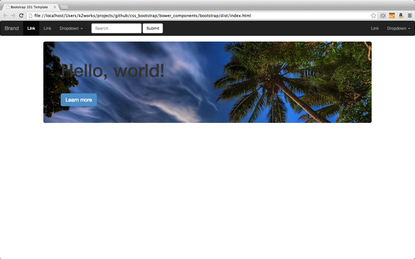

Bootstrap入門
=============

# 目的 #
[今日からはじめる！Twitter Bootstrap 3入門 〜Webデザイナーのための簡単サイト構築術〜](http://www.find-job.net/startup/twitter-bootstrap-3)を実習してBootstrapに習熟する。

# 前提 #
| ソフトウェア   | バージョン   | 備考        |
|:---------------|:-------------|:------------|
| OS X           |10.8.5        |       |
| npm            |1.2.18        |       |
| bower          |1.2.7         |       |
| grunt          |0.1.11        |       |
| bootstrap      |3.0.2         |       |

# 構成 #
+ [セットアップ](#chapter1) 
+ [ページ作成](#chapter2) 

# 詳細 #
## <a name="chapter1">セットアップ ##

### Bowerの設定 ###
    $ brew install node.js
    $ npm install bower -g
    $ /usr/local/share/npm/bin/bower -v
    $ /usr/local/share/npm/bin/bower init

### Gruntの設定 ###
    $ npm install -g grunt-cli
    $ /usr/local/share/npm/bin/grunt -v    

### Bootstrapの設定 ###
    $ cd bower_components/bootstrap/
    $ /usr/local/share/npm/bin/bower install bootstrap
    $ cd bower_components/bootstrap/
    $ /usr/local/share/npm/bin/grunt
    $ tree dist/
        dist/
        ├── css
        │   ├── bootstrap-theme.css
        │   ├── bootstrap-theme.min.css
        │   ├── bootstrap.css
        │   └── bootstrap.min.css
        ├── fonts
        │   ├── glyphicons-halflings-regular.eot
        │   ├── glyphicons-halflings-regular.svg
        │   ├── glyphicons-halflings-regular.ttf
        │   └── glyphicons-halflings-regular.woff
        └── js
            ├── bootstrap.js
            └── bootstrap.min.js

## <a name="chapter2">ページ作成 ##

### index.htmlを作成する ###

    <!DOCTYPE html>
    <html>
     <head>
      <title>Bootstrap 101 Template</title>
      <meta name="viewport" content="width=device-width, initial-scale=1.0">
      <!-- Bootstrap -->
      <link href="css/bootstrap.min.css" rel="stylesheet">

      <!-- HTML5 Shim and Respond.js IE8 support of HTML5 elements and media queries -->
      <!-- WARNING: Respond.js doesn't work if you view the page via file:// -->
      <!--[if lt IE 9]>
          script>
          script>
          <![endif]-->
     </head>
     <body>
      <h1>Hello, world!</h1>

      <!-- jQuery (necessary for Bootstrap's JavaScript plugins) -->
      
      <!-- Include all compiled plugins (below), or include individual files as needed -->
      
     </body>
    </html>>

### CSS,Componentsをコピーする ###
1. navbarの設定

[Default navbar](http://getbootstrap.com/components/#navbar-default)

1. 背景色を変える

        <nav class="navbar navbar-inverse" role="navigation">

1. Jumbotronの設定

[Jumbotron](http://getbootstrap.com/components/#jumbotron)

1. 真ん中寄せにする

        

          

          ....
        

### カスタマイズする ###
1. bootstrap/less/jumbotron.lessファイルを編集する。

        background-image: url(http://lorempixel.com/1200/400/nature);

1. コンパイルする

        $ cd ..
        $ /usr/local/share/npm/bin/grunt dist-css
        $ cd dist

1. 画面を確認する

   
    
# 参照 #

[Getting started](http://getbootstrap.com/getting-started/)

[Bower入門(基礎編)](http://yosuke-furukawa.hatenablog.com/entry/2013/06/01/173308)

[Bower](http://bower.io/#defining-a-package)

[Web制作で面倒な作業を自動化するビルドツール、Grunt v0.4 入門](http://kojika17.com/2013/03/grunt.js-memo.html)

[Bootstrap3でLESS/JSのコンパイル方法が変更に](http://re-dzine.net/2013/08/compile-in-bootstrap3/)

[今日からはじめる！Twitter Bootstrap 3入門 〜Webデザイナーのための簡単サイト構築術〜](http://www.find-job.net/startup/twitter-bootstrap-3)

[imgタグを記述するだけでダミーの画像を表示してくれるサービス「lorempixel」が便利](http://ozpa-h4.com/2013/01/29/lorempixel-dummy-img/)

[コーダーさんの為のGrunt入門（前編）〜導入編](http://blog.mach3.jp/2013/03/21/gruntjs.html)

[コーダーさんの為のGrunt入門（後編）〜CSSプリコンパイラ編](http://blog.mach3.jp/2013/03/26/gruntjs-css.html)
